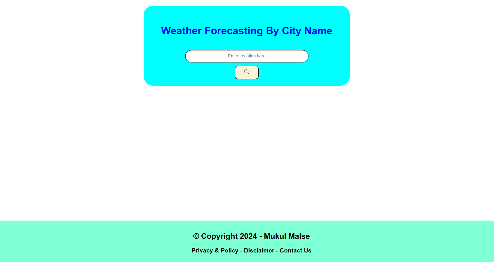
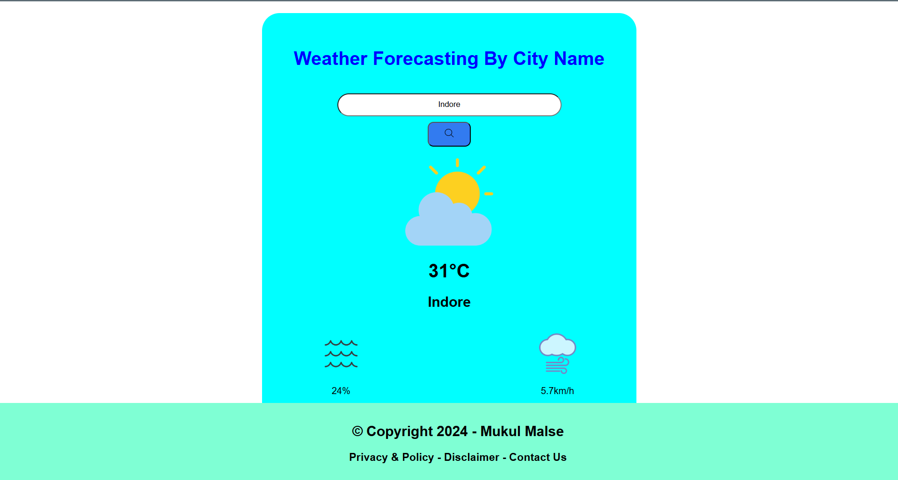

<h1 align="center">🌤️ Weather Forecasting App</h1>

## 🌐 Overview
A simple weather forecasting web application built using HTML, CSS, and JavaScript. It fetches real-time weather data using the OpenWeatherMap API and displays current weather conditions for any city around the world.

## 🚀 Features

- 🔍 Search weather by city name  
- 🌡️ Shows temperature, humidity, wind speed, and general conditions  
- 🕐 Real-time weather updates from the OpenWeatherMap API  
- 🎨 Responsive and clean user interface  

## 🛠️ Tech Stack

- **Frontend**: HTML, CSS, JavaScript  
- **API**: [OpenWeatherMap API](https://api.openweathermap.org/data/2.5/weather?units=matric&q=)

## 📦 How to Run Locally

1. Clone this repository:

```bash
git clone https://github.com/yourusername/weather-forecasting-app.git
cd weather-forecasting-app

2. Open the index.html file in your browser:
open index.html

3. Insert your API key in the JavaScript file:
const apiKey = "https://api.openweathermap.org/data/2.5/weather?units=matric&q=";

```
## 📁 Project Structure
weather-forecasting-app/<br>
├── index.html<br>
├── style.css<br>
├── script.js<br>
└── README.md

## 🧠 How It Works
<ul>
  <li>User inputs a city name.</li>
  <li>JavaScript sends a request to the OpenWeatherMap API.</li>
  <li>API returns weather data in JSON format.</li>
  <li>The app dynamically updates the UI with the fetched data.</li>
</ul>

## 📸 Demo (ScreenShots)



